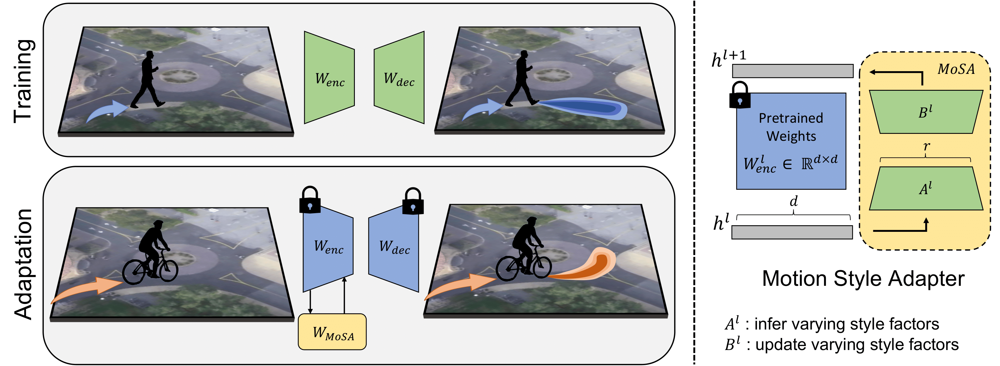
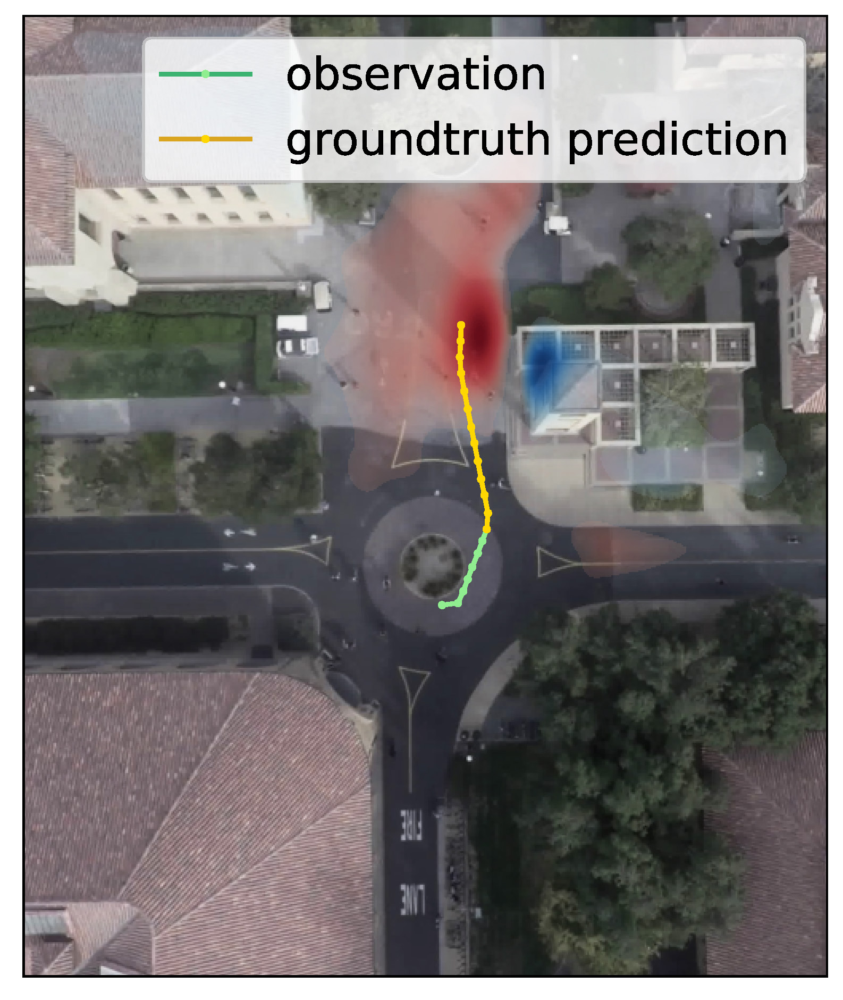
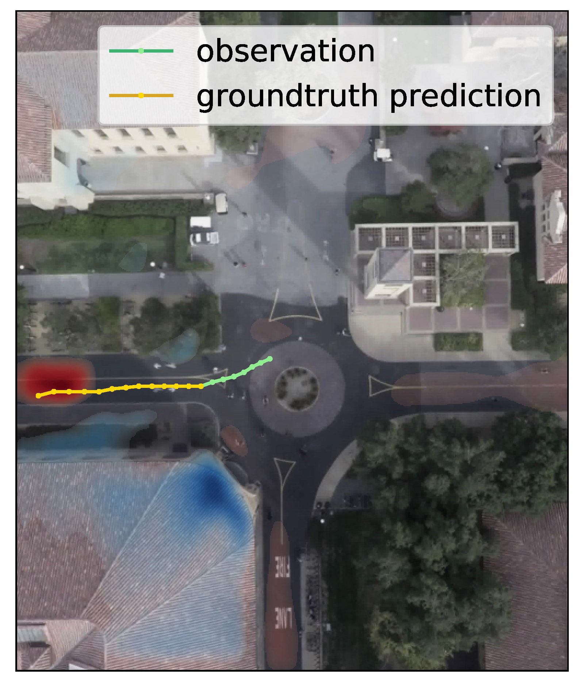
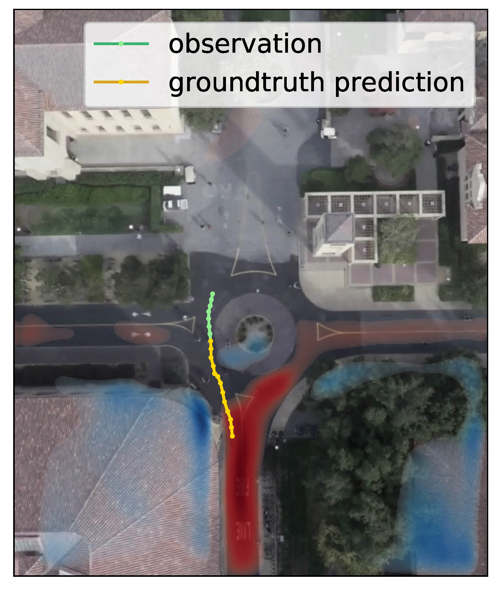

# Motion Style Transfer


**[`Paper`](link) | [`Video`](link) | [`Poster`](link)**

This is an implementation of the paper

**Modular Low-Rank Style Transfer for Deep Motion Forecasting**
<br>
<a href="https://thedebugger811.github.io">Parth Kothari*</a>, 
<a href="https://people.epfl.ch/danya.li/?lang=en">Danya Li*</a>, 
<a href="https://sites.google.com/view/yuejiangliu">Yuejiang Liu</a>,
<a href="https://people.epfl.ch/alexandre.alahi/?lang=en/">Alexandre Alahi</a>
<br>
École Polytechnique Fédérale de Lausanne (EPFL)

*Under Review*


## Overview

We propose efficient adaptation of deep motion forecasting models pretrained in one domain with sufficient data to new styles with *limited samples* through the following designs: 

* a low-rank motion style adapter, which projects and adapts the style features at a low-dimensional bottleneck

* a modular adapter strategy, which disentangles the features of scene context and motion history to facilitate a fine-grained choice of adaptation layers

<p align="center">
  
</p>


## Setup

Use `python=3.8`.

Install PyTorch, for example using pip

```
pip install --upgrade pip
pip install torch==1.9.0+cu111 torchvision==0.10.0+cu111 torchaudio==0.9.0 -f https://download.pytorch.org/whl/torch_stable.html
```

Install dependencies
```
pip install -r requirements.txt
```


## Data

We provide raw and processed SDD dataset, segmentation models for both SDD and inD images, and pretrained models for both SDD and inD experiments. You can get them via `bash scripts/get_pretrained_model_and_data.sh`. 

Due to copyright, we cannot provide data for inD dataset. Please request the inD file from the authors and then use the `bash scripts/inD/processing.sh` file for preprocessing. 

The data directory should have the following structure:
```
data
├── sdd
│   ├── raw/annotations/
│   ├── filter
│   |    ├── shortterm
│   |    |    ├── avg_vel/
│   |    |    └── agent_type/
│   |    └── longterm/agent_type/
│   └── sdd_segmentation.pth 
|
└── inD-dataset-v1.0
    ├── images/
    ├── data/
    ├── filter
    |    ├── shortterm/agent_type/
    |    └── longterm/agent_type/
    └── inD_segmentation.pth 

```

In addition to our provided datasets, you can refer to `utils.inD_dataset.py` or `utils.sdd_dataset.py` to create customized ones. 


## Experiments 

There are 5 sets of experiments provided in our paper:

| Experiment | Dataset used | Model used | Prediction | Pretraining | Adaptation |
|----------|--------|----------|--------|----------|--------|
| Motion Style Transfer across Agents | SDD | Y-Net | short-term | pedestrians (all scenes) | bikers (deathCircle_0) |
| Motion Style Transfer across Scenes | inD | Y-Net | long-term | pedestrians (scenes=2,3,4) | pedestrians (scenes=1) | 
| Modular Style Adapter (Agent motion) | inD | Y-Net-Mod | long-term |cars (scenes=1) | trucks (scenes=1) | 
| Modular Style Adapter (Scene) | inD | Y-Net-Mod | short-term | pedestrians (scenes=2,3,4) | pedestrians (scenes=1) |
| Modular Style Adapter (Agent motion) | SDD | Y-Net-Mod | shot-term | bikers (low speed) | bikers (high speed)

The above experiments correpond to scripts as follows:

| Experiment | Script folder | 
|------------|---------------|
| Motion Style Transfer across Agents | `scripts/sdd/ped_to_biker/` | 
| Motion Style Transfer across Scenes | `scripts/inD/ped_to_ped/ynet/` | 
| Modular Style Adapter (Agent motion) | `scripts/inD/scene1_car_to_truck/` | 
| Modular Style Adapter (Scene) | `scripts/inD/ped_to_ped/ynetmod/` | 
| Modular Style Adapter (Agent motion) | `scripts/sdd/biker_low_to_high/` |

In each folder, scripts for pretraininng, generalizing, baseline fine-tuning, and MoSA fine-tuning are provided. 


## Qualitative Results

We present three examples from motion style transfer across agents (pedestrians to bikers) on SDD. Each of the figures below illustrates the difference in goal decoder output of Y-Net on the adaptation of pedestrian-trained model using our proposed style-injection modules, where red means increased focus and blue means decreased focus. 
Adapted Y-Net successfully learns the style differences between the behavior of pedestrians and bikers:
* it correctly infers valid areas of traversal (move on bikerways instead of sidewalks)
* it updates the motion style parameters (new goal position is farther than old one)
* it effectively captures bikers' multimodality 


<p float="left">
  
   
  
</p>
